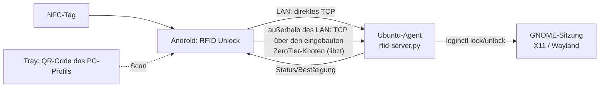

# RFID Unlock (Ubuntu-RFID-Android)

[Русский](README.md) · [English](README.en.md) · [Español](README.es.md) · **Deutsch**

**Das Smartphone als Schlüssel zum Rechner.** Eine Android-App plus ein kleiner
Agent auf Ubuntu. Handy an den NFC-Tag halten — der PC entsperrt sich; wegnehmen
— er sperrt. Eine Kachel in den Schnelleinstellungen sperrt jeden gespeicherten
PC mit einem Tipp, und `sudo` auf dem PC selbst wird per Knopfdruck am Handy
bestätigt, statt ein Passwort zu tippen.

Funktioniert aus jedem Netz: im gemeinsamen LAN direkt über TCP (~30 ms),
außerhalb über einen **eingebauten ZeroTier-Knoten** (libzt, im User Space, ohne
den VPN-Slot von Android zu belegen). Befehle sind mit **HMAC-SHA256** signiert
und gegen Wiedereinspielung geschützt; außer Handy und PC gehört nichts zum
Aufbau.

> Status: funktionierendes Produkt. Die Abnahmekriterien der Spezifikation sind
> an echten Geräten bestätigt.

> Hinweis: die Oberfläche von App und Agent ist auf Russisch; dieses Dokument ist
> eine Übersetzung von [README.md](README.md).

---

## Funktionen

- 📲 Registrierung von NFC-Tags per UID, lesbare Namen, Ein-/Ausschalten.
- 🔓 Automatisches **UNLOCK** beim Anhalten des Tags und **LOCK** beim Wegnehmen
  (Modi „Anwesenheit“ und „Umschalten“).
- 🔌 **LOCK, wenn das Handy vom Ladegerät getrennt wird** (Abnehmen von der
  Type-C-Dockingstation): der PC des letzten Tags im Modus „Anwesenheit“ sowie
  jeder PC mit gesetztem Schalter in den „Details“ der Kachel (pro PC
  einstellbar).
- 🖥️ **PC-Profile**: werden durch Scannen des **QR-Codes** aus dem Systemtray des
  Agenten hinzugefügt; **Kachel**-Ansicht mit farbigem Sperrstatus und
  Betriebssystem-Symbol.
- 👆 Tipp auf die Kachel schaltet LOCK/UNLOCK um; langes Drücken zeigt Details
  und erlaubt das Löschen des Profils.
- 🔗 Bindung eines Tags an einen bestimmten PC oder „universeller“ Tag (öffnet
  die Kachelansicht, ohne Befehle zu senden).
- 🧩 **Kacheln in den Schnelleinstellungen** (4 Plätze): jeder wird ein eigener PC
  zugewiesen, ein Tipp schaltet die Sperre um, ohne die App zu öffnen.
- 🌍 **Netzunabhängigkeit**: außerhalb des LAN laufen die Befehle über den
  **eingebauten ZeroTier-Knoten** — der VPN-Slot von Android bleibt frei, andere
  VPNs (etwa Hiddify) laufen parallel weiter (unsere App muss dort in die
  Ausnahmen eingetragen werden).
- 🔋 Akkuschonend: der eingebaute Knoten läuft nur für die Dauer eines Befehls und
  schaltet sich nach 5 Minuten Leerlauf ab; es gibt keine
  Hintergrund-Netzdienste.
- 👍 **`sudo`-Bestätigung vom Handy**: PC und Handy werden gleichzeitig gefragt —
  was schneller ist, das Passwort zu tippen oder „Bestätigen“ zu drücken; in der
  Benachrichtigung steht, welchen Befehl man genau bestätigt.
- 🔐 **Mit HMAC-SHA256 signierte Befehle** (das Token selbst geht nie über das
  Netz) plus Zeitfenster und Nonce gegen Wiedereinspielung.

---

## Architektur



- **Android** (`android-app/`): Kotlin, Jetpack Compose, Room, NFC Reader Mode,
  QR-Scanner (ZXing), TileService (Schnelleinstellungen), **libzt** (eingebautes
  ZeroTier, arm64-AAR in `app/libs/`).
- **Ubuntu-Agent** (`ubuntu-agent/`): TCP-Server in Python (Dual Stack, `::`)
  plus Tray-Symbol mit dem QR-Code des Profils.
- **Transport**: zeilenweises JSON über TCP (Port `5390`). Der Client wählt den
  Weg selbst: hat das Gerät eine Schnittstelle im Subnetz des PCs (gemeinsames
  LAN oder System-ZeroTier), nimmt es einen direkten Socket, sonst einen Socket
  über den eingebauten ZeroTier-Knoten.
- **Protokoll**: `{"cmd":"lock|unlock|status|ask|confirm|register","reqId":"<uuid>","ts":<Unix-Sek>,
  "sig":"<hex HMAC-SHA256(token, cmd|reqId|ts)>"}` →
  `{"reqId":"…","status":"ok|error","detail":"…",
  "sig":"<hex HMAC-SHA256(token, reqId|status|detail|lan)>"}` — auch die Antwort
  ist signiert und an die `reqId` der Anfrage gebunden.

Der eingebaute Knoten (AAR-Bau, Stolpersteine, Messungen) —
[Паспорт-libzt.md](Паспорт-libzt.md).
Vollständige Anforderungen — [ТЗ-RFID-Unlock.md](ТЗ-RFID-Unlock.md).
Für Anwender: [Инструкция-пользователя.md](Инструкция-пользователя.md).
(Diese Dokumente sind auf Russisch.)

---

## Aufbau des Repositorys

```
android-app/      Android-App (Kotlin/Compose)
  app/libs/         libzt-release.aar — eingebautes ZeroTier (arm64)
  …/net/            Transport: LAN → direkter Socket → eingebautes ZeroTier
  …/confirm/        Bestätigung von Aktionen am PC (Push + Knöpfe)
ubuntu-agent/     PC-Agent: TCP-Server, Tray, Installer
  rfid-server.py    TCP-Server lock/unlock/status/ask/confirm/register
  rfid-tray.py      Tray mit Profil-QR-Code, Symbol und Eintrag im Programmmenü
  rfid-confirm.py   Bestätigung einer Aktion am Handy (Rückgabecode 0/1/2)
  rfid-askpass      SUDO_ASKPASS-Wrapper um rfid-confirm.py
  rfid-pam-confirm  PAM-Helfer: sudo ohne Passwort, per Bestätigung am Handy
  install-pam.sh    installiert die PAM-Variante (mit Backup und Auto-Rollback)
  install-server.sh installiert Server und Tray als User-Service
  test_auth.py      Regressionstest der HMAC-Authentifizierung
  test_confirm.py   Regressionstest des ask/confirm-Ablaufs
  test_askpass.py   Regressionstest des Wettlaufs „Terminal/Fenster ↔ Handy“
  test_lan_reply.py Regressionstest: status liefert die LAN-Adresse des PCs
  yggdrasil/        alternative Schicht (ungenutzt; Setup-Skripte)
tools/bump-version.sh  Produktversion anheben und Tag setzen
VERSION           einheitliche Versionsnummer für Agent und App
CHANGELOG.md      Änderungsprotokoll nach Versionen
ТЗ-RFID-Unlock.md Technische Spezifikation
Паспорт-libzt.md  Eingebautes ZeroTier: Umsetzungsdetails
```

---

## Versionen

Eine Nummer für das ganze Produkt: Agent und App erscheinen zusammen und müssen
zusammenpassen (die App prüft die Signatur der Antworten, die ein älterer Agent
nicht setzt). Quelle der Wahrheit ist die Datei [`VERSION`](VERSION): daraus
liest Gradle `versionName`/`versionCode`, und das Installationsskript legt eine
Kopie neben die Konfiguration des Agenten. Das Schema ist
[semantisch](https://semver.org/lang/de/), die Änderungen stehen in
[CHANGELOG.md](CHANGELOG.md).

```bash
rfid-server.py --version   # Version des Agenten; die der App steht unten in den „Einstellungen“
```

Version anheben (die Änderungen vorher in `CHANGELOG.md` beschreiben):

```bash
tools/bump-version.sh 1.1.0
git push origin main --follow-tags
```

---

## Voraussetzungen

- **PC**: Ubuntu mit GNOME (X11 oder Wayland), systemd-logind (`loginctl`).
- **Handy**: Android 10+ mit NFC (das eingebaute ZeroTier ist arm64).
- Für den Betrieb **außerhalb eines gemeinsamen LAN**: ein ZeroTier-Netz (eigener
  Controller oder my.zerotier.com); in Netzen, in denen die öffentlichen
  ZeroTier-Roots blockiert sind, ein eigener Moon-Server (siehe
  „ZeroTier einrichten“ unten).

---

## Installation

### Ubuntu-Agent

```bash
cd ubuntu-agent
./install-server.sh
```

Das Skript installiert Server und Tray nach `~/.local/bin`, erzeugt ein Token in
`~/.config/rfid-agent/token`, legt den User-Service `rfid-server.service` an und
startet ihn und richtet den Autostart des Trays ein.

```bash
systemctl --user status rfid-server.service
```

**Token wechseln** (falls er abgeflossen sein könnte): Datei löschen und neu
installieren — ein neues Token entsteht von selbst. Danach muss auf jedem Handy
der QR-Code erneut gescannt werden, sonst werden dessen Befehle als
`unauthorized` abgewiesen.

```bash
shred -u ~/.config/rfid-agent/token ~/.cache/rfid-agent/pc-profile-qr.png
./install-server.sh
```

### ZeroTier einrichten (für den Betrieb außerhalb des LAN)

Der PC muss Mitglied eines ZeroTier-Netzes sein (das übliche
`zerotier-cli join …`). Damit der QR-Code dem Handy die Parameter des eingebauten
Knotens übergibt, legen Sie diese Dateien in `~/.config/rfid-agent/` an:

| Datei | Inhalt |
|---|---|
| `zt-network` | ID des ZeroTier-Netzes (16 hex) |
| `zt-moon` | ID der Moon-Welt (hex) — falls ein eigener Root verwendet wird |
| `zt-roots` | binärer Planet-Blob für den eingebauten Knoten — die Moon-Datei `/var/lib/zerotier-one/moons.d/*.moon`, deren erstes Byte von `127` auf `1` geändert wurde |

`zt-moon`/`zt-roots` sind nur dort nötig, wo die öffentlichen ZeroTier-Roots
blockiert werden (der eingebaute Knoten nutzt dann Ihren Moon-Server als
einzigen Root). Nach dem Scannen des QR-Codes erscheint der Knoten der App im
Netz-Controller und muss **autorisiert** werden (die Node-ID steht in der App:
Einstellungen → „Eingebautes ZeroTier“).

### Android-App

Benötigt das Android SDK (platform 34, build-tools 34) und JDK 17+.

```bash
cd android-app
./gradlew assembleDebug
# APK: app/build/outputs/apk/debug/app-debug.apk
adb install -r app/build/outputs/apk/debug/app-debug.apk
```

> `local.properties` (Pfad zum SDK) gehört nicht ins Repository — legen Sie eine
> eigene an: `sdk.dir=/pfad/zu/Android/Sdk`.
> Das libzt-AAR wird aus [zerotier/libzt](https://github.com/zerotier/libzt) neu
> gebaut (`pkg/android`, NDK 25.1, JDK 17) — die fertige arm64-Fassung liegt in
> `app/libs/`. Nach jedem Neubau des AAR unbedingt
> `tools/patch-libzt-detach.py app/libs/libzt-release.aar` ausführen (entfernt
> `DetachCurrentThread` aus den JNI-Wrappern stop/free — sonst endet das Stoppen
> des Knotens in SIGABRT).

---

## Benutzung

1. Agent auf dem PC starten (nach der Installation startet er selbst).
2. In der App den **QR-Code** aus dem Tray des Agenten scannen — der PC erscheint
   als Kachel.
3. Ist ZeroTier eingerichtet, den Knoten der App im Netz-Controller autorisieren.
4. Handy an einen NFC-Tag halten — die App bietet an, ihn zu speichern und einem
   PC zuzuordnen. Bei einem aktiven Tag: Anhalten → UNLOCK, Wegnehmen bzw.
   Trennen vom Ladegerät → LOCK.
5. Bei Bedarf eine **Kachel in den Schnelleinstellungen** hinzufügen
   („RFID ПК 1…4“) und ihr einen PC zuweisen — Sperren mit einem Tipp von
   überall.

**Geschwindigkeit.** Im selben Netz wie der PC geht der Befehl direkt an dessen
LAN-Adresse — ~50 ms. Die Adresse kommt im QR-Code und wird in den Antworten auf
`status` aktualisiert (übersteht also DHCP). Antwortet der LAN-Weg nicht binnen
400 ms, greift der bisherige: direkte Verbindung oder eingebauter
ZeroTier-Knoten. Der erste Befehl nach längerem Leerlauf außerhalb des LAN dauert
bis zu ~40 s (Start des Knotens und NAT-Durchstoß); die folgenden 5 Minuten geht
es sofort.

---

## PC-Aktionen vom Handy bestätigen

`sudo` (oder jede andere Aktion) lässt sich per Knopfdruck am Handy bestätigen,
statt ein Passwort zu tippen. Es werden **beide Kanäle gleichzeitig** gefragt —
wer zuerst antwortet:

- am PC — die übliche Passwortabfrage im Terminal (ohne Echo), und wenn es kein
  Terminal gibt (Start aus der GUI) — ein `zenity`/`kdialog`-Fenster;
- am Handy — eine Push-Benachrichtigung „Bestätigen / Ablehnen“ mit dem Text
  **genau dieses Befehls** (`sudo: apt-get update`); das Votum kommt über den
  normalen Kanal mit HMAC-Signatur zurück.

Wird das Passwort am PC eingegeben, wird die Anfrage am Handy zurückgezogen
(Votum `cancel`); wird der Knopf am Handy gedrückt, schließt sich Fenster bzw.
Abfrage am PC, das Passwort kommt aus dem Schlüsselbund und wird lokal
ausgegeben.

```
sudo -A ──> rfid-askpass ─┬─> Terminal oder Fenster am PC ──> Passwort ──> sudo
                          └─> Agent ──Push(id+Befehl)──> Handy
                                                            │ Votum (HMAC)
                          ja → Passwort aus Keyring | nein/Timeout → exit 1
```

**Push einrichten (einmalig):**

1. Ein kostenloses Projekt in der [Firebase Console](https://console.firebase.google.com/)
   anlegen und eine Android-App mit dem Paket `com.rfidunlock.app` hinzufügen.
2. `google-services.json` nach `android-app/app/` legen und das APK neu bauen
   (die Datei steht in `.gitignore` — sie enthält Projekt- und App-ID). Ohne sie
   baut und läuft das Projekt; es fehlen nur die Bestätigungen.
3. Den Schlüssel des Dienstkontos (Project settings → Service accounts →
   Generate new private key) auf den PC legen:
   ```bash
   install -m 600 ~/Downloads/<Schlüssel>.json ~/.config/rfid-agent/fcm-sa.json
   ```
4. Die App starten und **Benachrichtigungen erlauben** (wird beim ersten Start
   gefragt). Ohne diese Berechtigung kommt der Push an, die Knöpfe sind aber
   nicht zu sehen. Ihr Push-Token schickt die App dem Agenten selbst (Befehl
   `register`, Datei `~/.config/rfid-agent/fcm-token`).

Zum Ausprobieren ohne sudo-Umbau: `rfid-confirm.py "Test" -t 60` — am Handy
erscheint eine Benachrichtigung mit Knöpfen, Rückgabecode 0 (bestätigt) oder 1
(Ablehnung/Timeout). Regressionstest des Kanal-Wettlaufs:
`ubuntu-agent/test_askpass.py`.

**Das sudo-Passwort** gehört in den Schlüsselbund, nicht auf die Platte:

```bash
secret-tool store --label="sudo" service rfid-agent user "$USER"
```

Das muss **in einem echten Terminal** eingegeben werden: ohne tty speichert
`secret-tool` stillschweigend ein leeres Geheimnis. Alternativ, wenn kein
Schlüsselbund genutzt wird: `~/.config/rfid-agent/sudo.pass` (chmod 600).

**Einschalten für sudo** — in `~/.bashrc` (oder `~/.zshrc`):

```bash
export SUDO_ASKPASS="$HOME/.local/bin/rfid-askpass"
alias sudo='sudo -A'
```

### Ganz ohne gespeichertes Passwort: PAM

Das obige Verfahren gibt ein Passwort aus dem Schlüsselbund aus. Man kann ganz
darauf verzichten und die Bestätigung an PAM hängen: `sudo` lässt dann per
Knopfdruck am Handy durch, und nirgends liegt ein Passwort:

```bash
sudo ubuntu-agent/install-pam.sh
```

Das Skript legt Helfer und eine Kopie von `rfid-confirm.py` in root-eigene
Verzeichnisse (wer Dateien im Home ändern darf, darf damit nicht root werden),
sichert `/etc/pam.d/sudo`, stellt einen **Auto-Rollback-Timer auf 10 Minuten**
und fügt die Zeile ein:

```
auth sufficient pam_exec.so quiet /usr/local/bin/rfid-pam-confirm
```

Prüfen Sie es in einem zweiten Terminal mit `sudo -k; sudo true` — die Anfrage
erscheint auf dem Handy. Klappt: `sudo systemctl stop rfid-pam-revert.timer`.
Klappt nicht: zehn Minuten warten oder
`sudo ubuntu-agent/install-pam.sh --uninstall`. Danach das Passwort löschen
(`secret-tool clear service rfid-agent user "$USER"`) und die Zeilen
`SUDO_ASKPASS`/`alias sudo` aus `~/.zshrc` entfernen.

Ablehnung oder Timeout schwächen nichts: der Stack läuft weiter und `sudo` fragt
wie gewohnt nach dem Passwort. Mit `sufficient` wird das Handy allerdings zum
**einzigen** Faktor; sollen es beide sein, ersetzen Sie `sufficient` durch
`required`.

**Für alles andere** — derselbe Mechanismus ohne Passwort:

```bash
rfid-confirm.py "Release auf Produktion ausrollen?" && ./deploy.sh
```

Keine Antwort binnen 60 s und kein Passwort am PC eingegeben → Ablehnung, `sudo`
fragt wie gewohnt nach dem Passwort (fail-closed).

> Änderungen in `ubuntu-agent/` wirken erst nach `./install-server.sh` (die
> Dateien werden nach `~/.local/bin` kopiert) und einem Neustart des Dienstes:
> `systemctl --user restart rfid-server.service`.

---

## Sicherheit

- Befehle werden mit HMAC-SHA256 und einem gemeinsamen Token **signiert**; das
  Token selbst geht nie über das Netz. Wiederholungen wehren ein Zeitfenster
  (±300 s) und ein Nonce-Cache ab. **Antworten werden mit demselben Token
  signiert** und sind an die `reqId` der Anfrage gebunden — ein Angreifer auf dem
  Weg kann weder die Adresse des PCs austauschen noch ein falsches „gesperrt“
  vortäuschen. Regressionstest: `ubuntu-agent/test_auth.py`.
- Ohne Token **startet der Server nicht** (fail-closed): das ganze LAN ohne
  Signaturprüfung abzuhören ist auch „vorübergehend“ nicht erlaubt.
- App-Daten gehen weder in die Cloud-Sicherung noch in die Übertragung auf ein
  neues Telefon (`allowBackup="false"` plus `data_extraction_rules.xml`) — die
  PC-Token liegen im Klartext in Room.
- Außerhalb des LAN wird der Verkehr zusätzlich von ZeroTier verschlüsselt (E2E).
- Im Repository liegen keine Geheimnisse: das Token in
  `~/.config/rfid-agent/token` (Rechte 600); echte Adressen der Infrastruktur in
  git-ignorierten Dateien. In der systemd-Unit steht bewusst kein Token —
  Unit-Dateien sind für andere lokale Nutzer lesbar.
- Beim Hinzufügen eines Profils steckt das Token im QR-Code — zeigen Sie diesen
  QR-Code nur vertrauenswürdigen Geräten. Das QR-Bild landet in
  `~/.cache/rfid-agent/` (Verzeichnis 700, Datei 600), nicht im gemeinsamen `/tmp`.
- Bestätigungen: im Push stehen nur die Anfrage-ID und der Text — weder Passwort
  noch Token, Zugriff auf den Push-Dienst bestätigt also nichts. Votum und
  Push-Token des Handys gehen in die HMAC-Signatur ein (ein Umbiegen von
  „ablehnen“ auf „annehmen“ unterwegs wird abgewehrt). Den Befehl `ask` nimmt der
  Server nur über Loopback an. Regressionstest: `ubuntu-agent/test_confirm.py`.
- **Erfordert menschliche Prüfung (A13):** das sudo-Passwort liegt im
  Schlüsselbund des PCs und wird lokal ausgegeben; von der Stärke her ist das
  `NOPASSWD` mit dem Handy als externem Faktor. Der Knopf „Bestätigen“ ist auf
  einem gesperrten Handy erst nach dem Entsperren erreichbar (Android lässt das
  Starten einer Activity vom Sperrbildschirm nicht zu).

---

## Lizenz

[MIT](LICENSE) © Ubuntu-RFID-Android Project Contributors.
