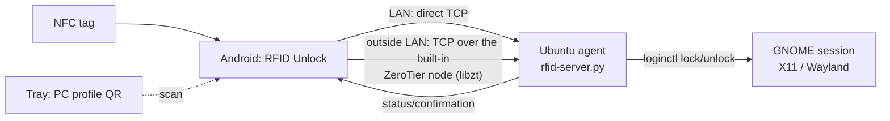

# RFID Unlock (Ubuntu-RFID-Android)

[Русский](README.md) · **English** · [Español](README.es.md) · [Deutsch](README.de.md)

**Your phone is the key to your computer.** An Android app plus a small agent on
Ubuntu. Tap the phone against an NFC tag — the PC unlocks; take it away — the PC
locks. A Quick Settings tile locks any saved PC with one tap, and `sudo` on the
PC itself is confirmed with a button on the phone instead of typing a password.

Works from any network: on a shared LAN it is direct TCP (~30 ms), outside it a
**built-in ZeroTier node** (libzt, userspace, without taking Android's VPN slot).
Commands are signed with **HMAC-SHA256** and protected against replay; nothing
beyond the phone and the PC is part of the scheme.

> Status: working product. The acceptance criteria of the spec are confirmed on
> real devices.

> Note: the app and agent interface is in Russian; this document is a
> translation of [README.md](README.md).

---

## Features

- 📲 Registering NFC tags by UID, human-readable names, enable/disable.
- 🔓 Automatic **UNLOCK** when the tag is presented and **LOCK** when it is
  removed (“Presence” and “Toggle” modes).
- 🔌 **LOCK when the phone is unplugged from the charger** (lifted off a Type-C
  dock): the PC of the last “Presence” tag plus any PC with the flag set in the
  tile’s “Details” (configured per PC).
- 🖥️ **PC profiles**: added by scanning a **QR code** from the agent’s system
  tray; a **tile** screen with a color-coded lock status and an OS icon.
- 👆 Tap a tile to toggle LOCK/UNLOCK; long-press for details and profile
  removal.
- 🔗 Binding a tag to a specific PC, or a “universal” tag (opens the tile screen
  without sending commands).
- 🧩 **Quick Settings tiles** (4 slots): each is assigned its own PC, a tap
  toggles the lock without opening the app.
- 🌍 **Network independence**: outside the LAN commands go through the **built-in
  ZeroTier node** — Android’s VPN slot stays free, other VPNs (Hiddify, for
  example) keep working in parallel (our app has to be added to their exclusions).
- 🔋 Battery friendly: the built-in node starts only for the duration of a
  command and shuts down after 5 minutes of idling; no background networking
  services.
- 👍 **Confirming `sudo` from the phone**: the PC and the phone are asked at the
  same time — whichever is faster, typing the password or pressing “Confirm”;
  the notification shows exactly which command you are confirming.
- 🔐 **HMAC-SHA256-signed commands** (the token itself is never sent over the
  network) plus a time window and a nonce against replay.

---

## Architecture



- **Android** (`android-app/`): Kotlin, Jetpack Compose, Room, NFC Reader Mode,
  QR scanner (ZXing), TileService (Quick Settings), **libzt** (built-in
  ZeroTier, arm64 AAR in `app/libs/`).
- **Ubuntu agent** (`ubuntu-agent/`): a Python TCP server (dual stack, `::`)
  plus a tray icon with the profile QR code.
- **Transport**: line-delimited JSON over TCP (port `5390`). The client picks
  the path itself: if the device has an interface in the PC’s subnet (shared LAN
  or system ZeroTier) it uses a direct socket, otherwise a socket through the
  built-in ZeroTier node.
- **Protocol**: `{"cmd":"lock|unlock|status|ask|confirm|register","reqId":"<uuid>","ts":<unix-sec>,
  "sig":"<hex HMAC-SHA256(token, cmd|reqId|ts)>"}` →
  `{"reqId":"…","status":"ok|error","detail":"…",
  "sig":"<hex HMAC-SHA256(token, reqId|status|detail|lan)>"}` — the reply is
  signed too and bound to the request’s `reqId`.

The built-in node (building the AAR, pitfalls, measurements) —
[Паспорт-libzt.md](Паспорт-libzt.md).
Full requirements — [ТЗ-RFID-Unlock.md](ТЗ-RFID-Unlock.md).
For end users: [Инструкция-пользователя.md](Инструкция-пользователя.md).
(These documents are in Russian.)

---

## Repository layout

```
android-app/      Android app (Kotlin/Compose)
  app/libs/         libzt-release.aar — built-in ZeroTier (arm64)
  …/net/            transport: LAN → direct socket → built-in ZeroTier
  …/confirm/        confirming actions on the PC (push + buttons)
ubuntu-agent/     PC agent: TCP server, tray, installers
  rfid-server.py    TCP server: lock/unlock/status/ask/confirm/register
  rfid-tray.py      tray with the profile QR code, icon and app-list entry
  rfid-confirm.py   confirming an action on the phone (exit code 0/1/2)
  rfid-askpass      SUDO_ASKPASS wrapper around rfid-confirm.py
  install-server.sh installs server+tray as a user service
  test_auth.py      regression test for HMAC authentication
  test_confirm.py   regression test for the ask/confirm flow
  test_askpass.py   regression test for the “terminal/window ↔ phone” race
  test_lan_reply.py regression test: status returns the PC’s LAN address
  yggdrasil/        alternative layer (unused; setup scripts)
tools/bump-version.sh  bump the product version and create the tag
VERSION           single version number for agent and app
CHANGELOG.md      changelog by version
ТЗ-RFID-Unlock.md Specification
Паспорт-libzt.md  Built-in ZeroTier: implementation details
```

---

## Versioning

One number for the whole product — the agent and the app are released together
and must match (the app verifies reply signatures that an older agent does not
produce). The source of truth is the [`VERSION`](VERSION) file: Gradle reads
`versionName`/`versionCode` from it, and the installer drops a copy next to the
agent’s config. The scheme is [semantic](https://semver.org/), changes are in
[CHANGELOG.md](CHANGELOG.md).

```bash
rfid-server.py --version   # agent version; the app shows its own at the bottom of Settings
```

To bump the version (describe the changes in `CHANGELOG.md` first):

```bash
tools/bump-version.sh 1.1.0
git push origin main --follow-tags
```

---

## Requirements

- **PC**: Ubuntu with GNOME (X11 or Wayland), systemd-logind (`loginctl`).
- **Phone**: Android 10+ with NFC (the built-in ZeroTier is arm64).
- To work **outside a shared LAN**: a ZeroTier network (self-hosted controller
  or my.zerotier.com); in networks where the public ZeroTier roots are blocked,
  your own moon server (see “ZeroTier setup” below).

---

## Installation

### Ubuntu agent

```bash
cd ubuntu-agent
./install-server.sh
```

The script installs the server and the tray into `~/.local/bin`, generates a
token in `~/.config/rfid-agent/token`, creates and starts the
`rfid-server.service` user service, and sets the tray to autostart.

```bash
systemctl --user status rfid-server.service
```

**Rotating the token** (if it may have leaked): wipe the file and reinstall — a
new token is generated automatically. After that every phone has to scan the QR
code again, otherwise its commands are rejected as `unauthorized`.

```bash
shred -u ~/.config/rfid-agent/token ~/.cache/rfid-agent/pc-profile-qr.png
./install-server.sh
```

### ZeroTier setup (for use outside the LAN)

The PC has to be a member of a ZeroTier network (the usual `zerotier-cli join …`).
For the QR code to pass the built-in node’s parameters to the phone, create
these files in `~/.config/rfid-agent/`:

| File | Contents |
|---|---|
| `zt-network` | ZeroTier network id (16 hex) |
| `zt-moon` | moon world id (hex) — if you use your own root |
| `zt-roots` | binary planet blob for the built-in node — the moon file `/var/lib/zerotier-one/moons.d/*.moon` with its first byte changed from `127` to `1` |

`zt-moon`/`zt-roots` are only needed where the public ZeroTier roots are blocked
(the built-in node then uses your moon server as its only root). After the QR
code is scanned, the app’s node shows up in the network controller and has to be
**authorized** (the node id is shown in the app: Settings → “Built-in ZeroTier”).

### Android app

Requires the Android SDK (platform 34, build-tools 34) and JDK 17+.

```bash
cd android-app
./gradlew assembleDebug
# APK: app/build/outputs/apk/debug/app-debug.apk
adb install -r app/build/outputs/apk/debug/app-debug.apk
```

> `local.properties` (the SDK path) is not part of the repository — create your
> own: `sdk.dir=/path/to/Android/Sdk`.
> The libzt AAR is rebuilt from [zerotier/libzt](https://github.com/zerotier/libzt)
> (`pkg/android`, NDK 25.1, JDK 17) — a ready arm64 build sits in `app/libs/`.
> After rebuilding the AAR always run `tools/patch-libzt-detach.py app/libs/libzt-release.aar`
> (it removes `DetachCurrentThread` from the stop/free JNI wrappers — otherwise
> stopping the node ends in SIGABRT).

---

## Usage

1. Start the agent on the PC (after installation it starts automatically).
2. In the app, scan the **QR code** from the agent’s tray — the PC appears as a
   tile.
3. If ZeroTier is configured, authorize the app’s node in the network controller.
4. Tap the phone against an NFC tag — the app offers to save it and bind it to a
   PC. For an active tag: presenting → UNLOCK, removing/unplugging the charger →
   LOCK.
5. Optionally add a **Quick Settings tile** (“RFID ПК 1…4”) and assign a PC to
   it — locking with a single tap from anywhere.

**Speed.** On the same network as the PC the command goes straight to its LAN
address — ~50 ms. The address arrives in the QR code and is refreshed in the
replies to `status` (so it survives DHCP). If the LAN path does not answer
within 400 ms, the previous one takes over: a direct connection or the built-in
ZeroTier node. The first command after a long idle outside the LAN takes up to
~40 s (node startup and NAT traversal); for the next 5 minutes it is instant.

---

## Confirming PC actions from the phone

`sudo` (or any other action) can be confirmed with a button on the phone instead
of typing a password. **Both channels are asked at once** — whichever answers
first:

- on the PC — the usual password prompt in the terminal (echo off), and if there
  is no terminal (started from a GUI) — a `zenity`/`kdialog` window;
- on the phone — a push notification “Confirm / Reject” carrying the text of
  **that very command** (`sudo: apt-get update`); the verdict comes back over
  the normal channel with an HMAC signature.

Type the password on the PC and the request on the phone is withdrawn (verdict
`cancel`); press the button on the phone and the window/prompt on the PC closes,
the password is taken from the keyring and printed locally.

```
sudo -A ──> rfid-askpass ─┬─> terminal or window on the PC ──> password ──> sudo
                          └─> agent ──push(id+command)──> phone
                                                            │ verdict (HMAC)
                          yes → password from keyring | no/timeout → exit 1
```

**Push setup (once):**

1. Create a free project in the [Firebase Console](https://console.firebase.google.com/)
   and add an Android app with the package `com.rfidunlock.app`.
2. Put `google-services.json` into `android-app/app/` and rebuild the APK (the
   file is in `.gitignore` — it contains the project and app ids). Without it
   the project builds and works — only confirmations are missing.
3. Put the service account key (Project settings → Service accounts → Generate
   new private key) on the PC:
   ```bash
   install -m 600 ~/Downloads/<key>.json ~/.config/rfid-agent/fcm-sa.json
   ```
4. Start the app and **allow notifications** (it asks on first launch). Without
   that permission the push arrives but the buttons are not shown. The app sends
   the agent its push token by itself (the `register` command, file
   `~/.config/rfid-agent/fcm-token`).

To try it without touching sudo: `rfid-confirm.py "Test" -t 60` — a notification
with buttons shows up on the phone, exit code 0 (confirmed) or 1
(rejected/timeout). Regression test for the channel race:
`ubuntu-agent/test_askpass.py`.

**The sudo password** belongs in the keyring, not on disk:

```bash
secret-tool store --label="sudo" service rfid-agent user "$USER"
```

Run this **in a real terminal**: without a tty `secret-tool` silently stores an
empty secret. Alternatively, if you do not use a keyring:
`~/.config/rfid-agent/sudo.pass` (chmod 600).

**Enabling it for sudo** — in `~/.bashrc` (or `~/.zshrc`):

```bash
export SUDO_ASKPASS="$HOME/.local/bin/rfid-askpass"
alias sudo='sudo -A'
```

**For anything else** — the same mechanism without a password:

```bash
rfid-confirm.py "Ship the release to production?" && ./deploy.sh
```

No answer within 60 s and no password typed on the PC → rejected, `sudo` asks
for the password as usual (fail-closed).

> Changes in `ubuntu-agent/` only take effect after `./install-server.sh` (the
> files are copied into `~/.local/bin`) and a service restart:
> `systemctl --user restart rfid-server.service`.

---

## Security

- Commands are **signed** with HMAC-SHA256 using a shared token; the token
  itself never travels over the network. Replays are rejected by a time window
  (±300 s) and a nonce cache. **Replies are signed with the same token** and
  bound to the request’s `reqId`, so an on-path attacker cannot swap the PC’s
  address or fake a “locked” status. Regression test: `ubuntu-agent/test_auth.py`.
- Without a token the server **refuses to start** (fail-closed): listening on the
  whole LAN without signature checks is not allowed, not even “temporarily”.
- App data goes neither into cloud backup nor into device-to-device transfer
  (`allowBackup="false"` plus `data_extraction_rules.xml`) — the PC tokens sit in
  Room in plain text.
- Outside the LAN the traffic is additionally encrypted by ZeroTier (E2E).
- No secrets are kept in the repository: the token lives in
  `~/.config/rfid-agent/token` (mode 600); real infrastructure addresses are in
  git-ignored files. The systemd unit deliberately holds no token — unit files
  are readable by other local users.
- The token is carried in the QR code when a profile is added — only show that
  QR code to trusted devices. The QR image is written to `~/.cache/rfid-agent/`
  (directory 700, file 600), not to the shared `/tmp`.
- Confirmations: the push carries only the request id and the text — neither the
  password nor the token — so access to the push service confirms nothing. The
  verdict and the phone’s push token are part of the HMAC signature (flipping
  “reject” into “approve” in transit is rejected). The `ask` command is accepted
  from loopback only. Regression test: `ubuntu-agent/test_confirm.py`.
- **Requires human review (A13):** the sudo password sits in the PC’s keyring
  and is printed locally; in terms of strength this is `NOPASSWD` with the phone
  as an external factor. The “Confirm” button on a locked phone is only reachable
  after unlocking (Android does not allow launching an Activity from the lock
  screen).

---

## License

[MIT](LICENSE) © Ubuntu-RFID-Android Project Contributors.
