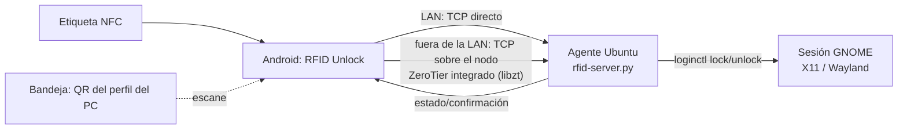

# RFID Unlock (Ubuntu-RFID-Android)

[Русский](README.md) · [English](README.en.md) · **Español** · [Deutsch](README.de.md)

**El móvil como llave del ordenador.** Una aplicación Android más un pequeño
agente en Ubuntu. Acercas el móvil a una etiqueta NFC y el PC se desbloquea; lo
retiras y se bloquea. Un mosaico en los ajustes rápidos bloquea cualquiera de los
PC guardados con un toque, y `sudo` en el propio PC se confirma con un botón en
el móvil en lugar de escribir la contraseña.

Funciona desde cualquier red: en la misma LAN va por TCP directo (~30 ms) y fuera
de ella a través de un **nodo ZeroTier integrado** (libzt, en espacio de usuario,
sin ocupar la ranura VPN de Android). Los comandos van firmados con
**HMAC-SHA256** y protegidos contra repetición; en el esquema no hay nada más que
el móvil y el PC.

> Estado: producto en funcionamiento. Los criterios de aceptación de la
> especificación están verificados en dispositivos reales (registro de pruebas —
> [PROGRESS.md](PROGRESS.md)).

> Nota: la interfaz de la aplicación y del agente está en ruso; este documento es
> una traducción de [README.md](README.md).

---

## Funciones

- 📲 Registro de etiquetas NFC por UID, nombres legibles, activar/desactivar.
- 🔓 **UNLOCK** automático al acercar la etiqueta y **LOCK** al retirarla (modos
  «Presencia» y «Conmutación»).
- 🔌 **LOCK al desconectar el móvil del cargador** (al sacarlo de una base
  Type-C): el PC de la última etiqueta en modo «Presencia» más cualquier PC con
  la marca activada en los «Detalles» del mosaico (se configura por PC).
- 🖥️ **Perfiles de PC**: se añaden escaneando el **código QR** de la bandeja del
  sistema del agente; pantalla de **mosaicos** con el estado del bloqueo en color
  y el icono del sistema operativo.
- 👆 Un toque en el mosaico alterna LOCK/UNLOCK; una pulsación larga muestra los
  detalles y permite borrar el perfil.
- 🔗 Vinculación de una etiqueta a un PC concreto o etiqueta «universal» (abre la
  pantalla de mosaicos sin enviar comandos).
- 🧩 **Mosaicos de ajustes rápidos** (4 ranuras): a cada uno se le asigna su PC y
  un toque alterna el bloqueo sin abrir la aplicación.
- 🌍 **Independencia de la red**: fuera de la LAN los comandos van por el **nodo
  ZeroTier integrado**, así la ranura VPN de Android queda libre y otras VPN (por
  ejemplo Hiddify) siguen funcionando en paralelo (hay que añadir nuestra
  aplicación a sus exclusiones).
- 🔋 Ahorro de batería: el nodo integrado se levanta solo mientras dura el comando
  y se apaga tras 5 minutos de inactividad; no hay servicios de red en segundo
  plano.
- 👍 **Confirmación de `sudo` desde el móvil**: se pregunta al PC y al móvil a la
  vez — lo que sea más rápido, escribir la contraseña o pulsar «Confirmar»; en la
  notificación se ve qué comando estás confirmando exactamente.
- 🔐 **Comandos firmados con HMAC-SHA256** (el token nunca viaja por la red) más
  ventana temporal y nonce contra la repetición.

---

## Arquitectura



- **Android** (`android-app/`): Kotlin, Jetpack Compose, Room, NFC Reader Mode,
  escáner QR (ZXing), TileService (ajustes rápidos), **libzt** (ZeroTier
  integrado, AAR arm64 en `app/libs/`).
- **Agente Ubuntu** (`ubuntu-agent/`): servidor TCP en Python (doble pila, `::`)
  más un icono en la bandeja con el código QR del perfil.
- **Transporte**: JSON por líneas sobre TCP (puerto `5390`). El cliente elige la
  ruta por sí mismo: si el dispositivo tiene una interfaz en la subred del PC
  (LAN común o ZeroTier del sistema) usa un socket directo; si no, un socket a
  través del nodo ZeroTier integrado.
- **Protocolo**: `{"cmd":"lock|unlock|status|ask|confirm|register","reqId":"<uuid>","ts":<seg-unix>,
  "sig":"<hex HMAC-SHA256(token, cmd|reqId|ts)>"}` →
  `{"reqId":"…","status":"ok|error","detail":"…"}`.

Detalles de la capa de red: [Архитектура-сетенезависимая-связь.md](Архитектура-сетенезависимая-связь.md)
(historia de la elección: Yggdrasil → ZeroTier) y [Паспорт-libzt.md](Паспорт-libzt.md)
(nodo integrado: compilación del AAR, tropiezos, mediciones).
Requisitos completos — [ТЗ-RFID-Unlock.md](ТЗ-RFID-Unlock.md).
Para el usuario: [Инструкция-пользователя.md](Инструкция-пользователя.md).
Estado del trabajo para la IA/el desarrollador: [Паспорт-задачи.md](Паспорт-задачи.md).
(Estos documentos están en ruso.)

---

## Estructura del repositorio

```
android-app/      Aplicación Android (Kotlin/Compose)
  app/libs/         libzt-release.aar — ZeroTier integrado (arm64)
  …/net/            transporte: LAN → socket directo → ZeroTier integrado
  …/confirm/        confirmación de acciones en el PC (push + botones)
ubuntu-agent/     Agente del PC: servidor TCP, bandeja, instaladores
  rfid-server.py    servidor TCP lock/unlock/status/ask/confirm/register
  rfid-tray.py      icono en la bandeja con el QR del perfil del PC
  rfid-confirm.py   confirmación de una acción en el móvil (código 0/1/2)
  rfid-askpass      envoltorio SUDO_ASKPASS sobre rfid-confirm.py
  install-server.sh instala servidor y bandeja como servicio de usuario
  test_auth.py      prueba de regresión de la autenticación HMAC
  test_confirm.py   prueba de regresión del flujo ask/confirm
  test_askpass.py   prueba de regresión de la carrera «terminal/ventana ↔ móvil»
  test_lan_reply.py prueba de regresión: status devuelve la dirección LAN del PC
  install.sh, rfid-agent.sh  primera versión vía GSConnect (heredada)
  yggdrasil/        capa alternativa (sin uso; scripts de instalación)
ТЗ-RFID-Unlock.md Especificación técnica
PROGRESS.md       Registro de avance por etapas
Паспорт-libzt.md  ZeroTier integrado: detalles de implementación
```

---

## Requisitos

- **PC**: Ubuntu con GNOME (X11 o Wayland), systemd-logind (`loginctl`).
- **Móvil**: Android 10+ con NFC (el ZeroTier integrado es arm64).
- Para funcionar **fuera de una LAN común**: una red ZeroTier (controlador
  propio o my.zerotier.com); en redes donde las raíces públicas de ZeroTier estén
  bloqueadas, un servidor moon propio (véase «Configuración de ZeroTier» abajo).

---

## Instalación

### Agente Ubuntu

```bash
cd ubuntu-agent
./install-server.sh
```

El script instala el servidor y la bandeja en `~/.local/bin`, genera un token en
`~/.config/rfid-agent/token`, crea e inicia el servicio de usuario
`rfid-server.service` y configura el arranque automático de la bandeja.

```bash
systemctl --user status rfid-server.service
```

### Configuración de ZeroTier (para funcionar fuera de la LAN)

El PC debe pertenecer a una red ZeroTier (el habitual `zerotier-cli join …`).
Para que el QR transmita al móvil los parámetros del nodo integrado, cree estos
archivos en `~/.config/rfid-agent/`:

| Archivo | Contenido |
|---|---|
| `zt-network` | id de la red ZeroTier (16 hex) |
| `zt-moon` | id del mundo moon (hex) — si usa una raíz propia |
| `zt-roots` | blob planet binario para el nodo integrado — el archivo moon `/var/lib/zerotier-one/moons.d/*.moon` con su primer byte cambiado de `127` a `1` |

`zt-moon`/`zt-roots` solo hacen falta donde las raíces públicas de ZeroTier estén
bloqueadas (entonces el nodo integrado usa su servidor moon como única raíz).
Tras escanear el QR, el nodo de la aplicación aparece en el controlador de la red
y hay que **autorizarlo** (el id del nodo se ve en la aplicación: Ajustes →
«ZeroTier integrado»).

### Aplicación Android

Requiere el SDK de Android (platform 34, build-tools 34) y JDK 17+.

```bash
cd android-app
./gradlew assembleDebug
# APK: app/build/outputs/apk/debug/app-debug.apk
adb install -r app/build/outputs/apk/debug/app-debug.apk
```

> `local.properties` (la ruta al SDK) no forma parte del repositorio — cree el
> suyo: `sdk.dir=/ruta/a/Android/Sdk`.
> El AAR de libzt se recompila desde [zerotier/libzt](https://github.com/zerotier/libzt)
> (`pkg/android`, NDK 25.1, JDK 17) — la versión arm64 lista está en `app/libs/`.
> Tras recompilar el AAR ejecute siempre `tools/patch-libzt-detach.py app/libs/libzt-release.aar`
> (elimina `DetachCurrentThread` de los envoltorios JNI stop/free; de lo
> contrario, detener el nodo termina en SIGABRT).

---

## Uso

1. Inicie el agente en el PC (tras la instalación arranca solo).
2. En la aplicación escanee el **código QR** de la bandeja del agente — el PC
   aparece como mosaico.
3. Si ZeroTier está configurado, autorice el nodo de la aplicación en el
   controlador de la red.
4. Acerque el móvil a una etiqueta NFC — la aplicación propondrá guardarla y
   vincularla a un PC. Con una etiqueta activa: acercar → UNLOCK, retirar o
   desconectar el cargador → LOCK.
5. Si quiere, añada un **mosaico a los ajustes rápidos** («RFID ПК 1…4») y
   asígnele un PC — bloqueo con un solo toque desde cualquier sitio.

**Velocidad.** En la misma red que el PC el comando va directo a su dirección LAN
(~50 ms). La dirección llega en el QR y se actualiza en las respuestas a `status`
(así sobrevive al DHCP). Si la ruta LAN no responde en 400 ms, entra la anterior:
conexión directa o nodo ZeroTier integrado. El primer comando tras una inactividad
larga fuera de la LAN tarda hasta ~40 s (arranque del nodo y travesía de NAT); los
5 minutos siguientes es instantáneo.

---

## Confirmar acciones del PC desde el móvil

`sudo` (o cualquier otra acción) se puede confirmar con un botón en el móvil en
lugar de escribir la contraseña. Se preguntan **los dos canales a la vez** — el
que responda primero:

- en el PC — la petición de contraseña habitual en el terminal (sin eco) y, si no
  hay terminal (inicio desde la GUI), una ventana `zenity`/`kdialog`;
- en el móvil — una notificación push «Confirmar / Rechazar» con el texto de **ese
  mismo comando** (`sudo: apt-get update`); el veredicto vuelve por el canal
  normal con firma HMAC.

Si escribe la contraseña en el PC, la petición del móvil se retira (veredicto
`cancel`); si pulsa el botón del móvil, la ventana o la petición del PC se cierra
y la contraseña se toma del llavero y se imprime localmente.

```
sudo -A ──> rfid-askpass ─┬─> terminal o ventana en el PC ──> contraseña ──> sudo
                          └─> agente ──push(id+comando)──> móvil
                                                            │ veredicto (HMAC)
                          sí → contraseña del llavero | no/timeout → exit 1
```

**Configuración de push (una sola vez):**

1. Cree un proyecto gratuito en la [consola de Firebase](https://console.firebase.google.com/)
   y añada una aplicación Android con el paquete `com.rfidunlock.app`.
2. Ponga `google-services.json` en `android-app/app/` y recompile el APK (el
   archivo está en `.gitignore`: contiene los id del proyecto y de la
   aplicación). Sin él el proyecto compila y funciona; solo faltan las
   confirmaciones.
3. Ponga la clave de la cuenta de servicio (Project settings → Service accounts →
   Generate new private key) en el PC:
   ```bash
   install -m 600 ~/Downloads/<clave>.json ~/.config/rfid-agent/fcm-sa.json
   ```
4. Abra la aplicación y **permita las notificaciones** (lo pregunta al primer
   inicio). Sin ese permiso el push llega, pero los botones no se ven. La
   aplicación envía al agente su token push por sí sola (comando `register`,
   archivo `~/.config/rfid-agent/fcm-token`).

Para probarlo sin tocar sudo: `rfid-confirm.py "Prueba" -t 60` — en el móvil
aparece una notificación con botones y el código de salida es 0 (confirmado) o 1
(rechazo/timeout). Prueba de regresión de la carrera de canales:
`ubuntu-agent/test_askpass.py`.

**La contraseña de sudo** guárdela en el llavero, no en disco:

```bash
secret-tool store --label="sudo" service rfid-agent user "$USER"
```

Ejecútelo **en un terminal de verdad**: sin tty `secret-tool` guarda en silencio
un secreto vacío. Como alternativa, si no usa llavero:
`~/.config/rfid-agent/sudo.pass` (chmod 600).

**Activación para sudo** — en `~/.bashrc` (o `~/.zshrc`):

```bash
export SUDO_ASKPASS="$HOME/.local/bin/rfid-askpass"
alias sudo='sudo -A'
```

**Para cualquier otra cosa** — el mismo mecanismo sin contraseña:

```bash
rfid-confirm.py "¿Desplegar la versión en producción?" && ./deploy.sh
```

Sin respuesta en 60 s y sin contraseña escrita en el PC → rechazo, y `sudo` pide
la contraseña como siempre (fail-closed).

> Los cambios en `ubuntu-agent/` solo surten efecto tras `./install-server.sh`
> (los archivos se copian a `~/.local/bin`) y reiniciar el servicio:
> `systemctl --user restart rfid-server.service`.

---

## Seguridad

- Los comandos van **firmados** con HMAC-SHA256 mediante un token compartido; el
  token en sí nunca viaja por la red. Las repeticiones se rechazan con una
  ventana temporal (±300 s) y una caché de nonces. Prueba de regresión:
  `ubuntu-agent/test_auth.py`.
- Fuera de la LAN el tráfico va además cifrado por ZeroTier (E2E).
- No se guardan secretos en el repositorio: el token está en
  `~/.config/rfid-agent/token` (permisos 600); las direcciones reales de la
  infraestructura, en archivos ignorados por git.
- El token viaja en el código QR al añadir un perfil — muestre ese QR solo a
  dispositivos de confianza.
- Confirmaciones: en el push solo van el id de la petición y el texto, ni la
  contraseña ni el token, así que el acceso al servicio push no confirma nada. El
  veredicto y el token push del móvil entran en la firma HMAC (cambiar «rechazar»
  por «aceptar» por el camino se detecta). El comando `ask` solo se acepta desde
  loopback. Prueba de regresión: `ubuntu-agent/test_confirm.py`.
- **Requiere revisión humana (A13):** la contraseña de sudo está en el llavero del
  PC y se imprime localmente; en cuanto a robustez, esto equivale a `NOPASSWD` con
  el móvil como factor externo. El botón «Confirmar» en un móvil bloqueado solo es
  accesible tras desbloquearlo (Android no permite lanzar una Activity desde la
  pantalla de bloqueo).

---

## Licencia

[MIT](LICENSE) © Ubuntu-RFID-Android Project Contributors.
