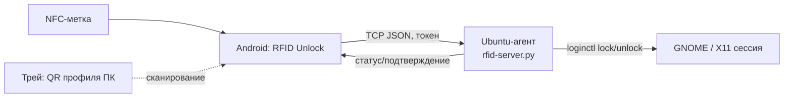

# RFID Unlock (Ubuntu-RFID-Android)

Бесконтактная блокировка/разблокировка ПК на **Ubuntu** с помощью смартфона на
**Android** и **NFC-метки**. Смартфон выступает физическим «ключом»: поднесли к
зарегистрированной метке — ПК разблокировался; убрали — заблокировался.

> Статус: рабочий прототип (MVP). Канал связи — собственный TCP-протокол по
> локальной сети; ведётся проработка сетенезависимого слоя (Yggdrasil).

---

## Возможности

- 📲 Регистрация NFC-меток по UID, удобочитаемые имена, включение/выключение.
- 🔓 Автоматический **UNLOCK** при поднесении метки и **LOCK** при снятии
  (режимы «Присутствие» и «Переключение»).
- 🔌 **LOCK при отключении телефона от зарядки** (снятие с Type-C дока).
- 🖥️ **Профили ПК**: добавление сканированием **QR-кода** из системного трея
  агента; экран **плиток** с цветным статусом замка и иконкой ОС.
- 👆 Клик по плитке — переключение LOCK/UNLOCK; долгое нажатие — сведения и
  удаление профиля.
- 🔗 Привязка метки к конкретному ПК или «универсальная» метка (открывает экран
  плиток без команд).
- 🔐 Аутентификация команд предварительным токеном (pre-shared token).

---

## Архитектура



- **Android** (`android-app/`): Kotlin, Jetpack Compose, Room, NFC Reader Mode,
  foreground-сервис, сканер QR (ZXing).
- **Ubuntu-агент** (`ubuntu-agent/`): Python TCP-сервер + трей с QR-кодом профиля.
- **Транспорт**: построчный JSON по TCP (порт по умолчанию `5390`):
  `{"cmd":"lock|unlock|status","reqId":"…","token":"…"}` →
  `{"reqId":"…","status":"ok|error","detail":"…"}`.

Подробнее о планируемом сетенезависимом слое (работа через разные сети, NAT) —
см. [Архитектура-сетенезависимая-связь.md](Архитектура-сетенезависимая-связь.md).
Полные требования — [ТЗ-RFID-Unlock.md](ТЗ-RFID-Unlock.md).

---

## Структура репозитория

```
android-app/      Android-приложение (Kotlin/Compose)
ubuntu-agent/     ПК-агент: TCP-сервер, трей, установщики
  rfid-server.py    TCP-сервер lock/unlock/status
  rfid-tray.py      иконка в трее с QR-кодом профиля ПК
  install-server.sh установка сервера+трея как user-сервиса
ТЗ-RFID-Unlock.md Техническое задание
PROGRESS.md       Журнал прогресса по этапам
```

---

## Требования

- **ПК**: Ubuntu 24.04 LTS, GNOME на **X11**, systemd-logind (`loginctl`).
- **Смартфон**: Android 10+ с NFC.
- Оба устройства в одной локальной сети (для текущего канала).

---

## Установка

### Ubuntu-агент

```bash
cd ubuntu-agent
./install-server.sh
```

Скрипт устанавливает сервер и трей в `~/.local/bin`, генерирует токен в
`~/.config/rfid-agent/token`, создаёт и запускает user-сервис
`rfid-server.service`, настраивает автозапуск трея. По завершении выводит IP,
порт и токен (или используйте QR-код из трея).

Управление сервисом:

```bash
systemctl --user status rfid-server.service
systemctl --user restart rfid-server.service
```

### Android-приложение

Требуется Android SDK (platform 34, build-tools 34) и JDK 17.

```bash
cd android-app
./gradlew assembleDebug
# APK: app/build/outputs/apk/debug/app-debug.apk
adb install -r app/build/outputs/apk/debug/app-debug.apk
```

> `local.properties` (путь к SDK) не входит в репозиторий — создайте свой:
> `sdk.dir=/path/to/Android/Sdk`.

---

## Использование

1. Запустите агент на ПК (после установки он стартует автоматически).
2. В приложении на телефоне отсканируйте **QR-код** из трея агента — ПК появится
   плиткой на главном экране.
3. Поднесите телефон к NFC-метке — приложение предложит её сохранить и привязать
   к ПК.
4. Активная метка: поднесение → UNLOCK, снятие (или отключение от зарядки) → LOCK.

---

## Безопасность

- Команды принимаются только с верным **токеном** (генерируется локально, в
  репозитории его нет).
- Секреты не хранятся в репозитории: токен — в `~/.config/rfid-agent/token`
  (права 600); реальные адреса инфраструктуры — в git-ignored `*.local`.
- Текущий MVP передаёт команды по TCP **в доверенной локальной сети без
  TLS**. При выходе за пределы LAN планируется: сетевой слой с E2E-шифрованием
  (Yggdrasil) + прикладная **HMAC-подпись команд** с anti-replay (nonce/timestamp).
  Подробности — в документе архитектуры.

> ⚠️ Не используйте текущий MVP в недоверенной сети без дополнительного слоя
> шифрования.

---

## Лицензия

[MIT](LICENSE) © Ubuntu-RFID-Android Project Contributors.
