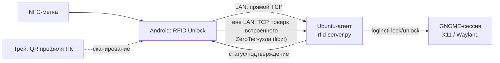

# RFID Unlock (Ubuntu-RFID-Android)

Бесконтактная блокировка/разблокировка ПК на **Ubuntu** с помощью смартфона на
**Android** и **NFC-метки**. Смартфон выступает физическим «ключом»: поднесли к
зарегистрированной метке — ПК разблокировался; убрали — заблокировался.

> Статус: рабочий продукт. Связь работает из любой сети (LAN, LTE, чужой Wi-Fi):
> прямой TCP в локальной сети + **встроенный ZeroTier-узел** (libzt, userspace)
> вне её. Команды защищены **HMAC-подписью** с anti-replay.

---

## Возможности

- 📲 Регистрация NFC-меток по UID, удобочитаемые имена, включение/выключение.
- 🔓 Автоматический **UNLOCK** при поднесении метки и **LOCK** при снятии
  (режимы «Присутствие» и «Переключение»).
- 🔌 **LOCK при отключении телефона от зарядки** (снятие с Type-C дока): ПК последней
  метки «Присутствие» + любые ПК с флагом в «Сведениях» плитки (настройка на каждый ПК).
- 🖥️ **Профили ПК**: добавление сканированием **QR-кода** из системного трея
  агента; экран **плиток** с цветным статусом замка и иконкой ОС.
- 👆 Клик по плитке — переключение LOCK/UNLOCK; долгое нажатие — сведения и
  удаление профиля.
- 🔗 Привязка метки к конкретному ПК или «универсальная» метка (открывает экран
  плиток без команд).
- 🧩 **Плитки шторки** (Quick Settings, 4 слота): каждой назначается свой ПК,
  тап — переключение блокировки без открытия приложения.
- 🌍 **Сетенезависимость**: вне LAN команды идут через **встроенный узел
  ZeroTier** — VPN-слот Android не занимается, другие VPN (например, Hiddify)
  работают параллельно (наше приложение нужно добавить в их исключения).
- 🔋 Экономия батареи: встроенный узел запускается только на время команды и
  гаснет через 5 минут простоя; фоновых сервисов связи нет.
- 🔐 **HMAC-SHA256-подпись команд** (токен по сети не передаётся) + окно
  времени и nonce против повтора.

---

## Архитектура



- **Android** (`android-app/`): Kotlin, Jetpack Compose, Room, NFC Reader Mode,
  сканер QR (ZXing), TileService (шторка), **libzt** (встроенный ZeroTier,
  arm64 AAR в `app/libs/`).
- **Ubuntu-агент** (`ubuntu-agent/`): Python TCP-сервер (двойной стек, `::`) +
  трей с QR-кодом профиля.
- **Транспорт**: построчный JSON по TCP (порт `5390`). Клиент сам выбирает
  путь: если у устройства есть интерфейс в подсети ПК (общая LAN или системный
  ZeroTier) — прямой сокет; иначе — сокет через встроенный узел ZeroTier.
- **Протокол**: `{"cmd":"lock|unlock|status","reqId":"<uuid>","ts":<unix-сек>,
  "sig":"<hex HMAC-SHA256(token, cmd|reqId|ts)>"}` →
  `{"reqId":"…","status":"ok|error","detail":"…"}`.

Детали сетевого слоя: [Архитектура-сетенезависимая-связь.md](Архитектура-сетенезависимая-связь.md)
(история выбора: Yggdrasil → ZeroTier) и [Паспорт-libzt.md](Паспорт-libzt.md)
(встроенный узел: сборка AAR, грабли, замеры).
Полные требования — [ТЗ-RFID-Unlock.md](ТЗ-RFID-Unlock.md).
Для пользователя: [Инструкция-пользователя.md](Инструкция-пользователя.md).
Состояние работ для ИИ/разработчика: [Паспорт-задачи.md](Паспорт-задачи.md).

---

## Структура репозитория

```
android-app/      Android-приложение (Kotlin/Compose)
  app/libs/         libzt-release.aar — встроенный ZeroTier (arm64)
  …/net/            транспорт: LAN → прямой сокет → встроенный ZeroTier
  …/confirm/        подтверждение действий на ПК (push + кнопки)
ubuntu-agent/     ПК-агент: TCP-сервер, трей, установщики
  rfid-server.py    TCP-сервер lock/unlock/status/ask/confirm/register
  rfid-tray.py      иконка в трее с QR-кодом профиля ПК
  rfid-confirm.py   подтверждение действия на смартфоне (код возврата 0/1/2)
  rfid-askpass      обёртка SUDO_ASKPASS поверх rfid-confirm.py
  install-server.sh установка сервера+трея как user-сервиса
  test_auth.py      регрессионный тест HMAC-аутентификации
  test_confirm.py   регрессионный тест потока ask/confirm
  test_lan_reply.py регрессионный тест: status отдаёт LAN-адрес ПК
  yggdrasil/        альтернативный слой (не используется; setup-скрипты)
ТЗ-RFID-Unlock.md Техническое задание
PROGRESS.md       Журнал прогресса по этапам
Паспорт-libzt.md  Встроенный ZeroTier: детали реализации
```

---

## Требования

- **ПК**: Ubuntu с GNOME (X11 или Wayland), systemd-logind (`loginctl`).
- **Смартфон**: Android 10+ с NFC (встроенный ZeroTier — arm64).
- Для работы **вне общей LAN**: сеть ZeroTier (самохост-контроллер или
  my.zerotier.com); в сетях, где публичные корни ZeroTier недоступны, — свой
  moon-сервер (см. «Настройка ZeroTier» ниже).

---

## Установка

### Ubuntu-агент

```bash
cd ubuntu-agent
./install-server.sh
```

Скрипт устанавливает сервер и трей в `~/.local/bin`, генерирует токен в
`~/.config/rfid-agent/token`, создаёт и запускает user-сервис
`rfid-server.service`, настраивает автозапуск трея.

```bash
systemctl --user status rfid-server.service
```

### Настройка ZeroTier (для работы вне LAN)

ПК должен состоять в сети ZeroTier (обычный `zerotier-cli join …`). Чтобы QR
передавал телефону параметры встроенного узла, создайте файлы в
`~/.config/rfid-agent/`:

| Файл | Содержимое |
|---|---|
| `zt-network` | id сети ZeroTier (16 hex) |
| `zt-moon` | id moon-мира (hex) — если используется свой корень |
| `zt-roots` | бинарный planet-блоб для встроенного узла — moon-файл `/var/lib/zerotier-one/moons.d/*.moon` с первым байтом, заменённым `127` → `1` |

`zt-moon`/`zt-roots` нужны только там, где публичные корни ZeroTier блокируются
(встроенный узел тогда использует ваш moon-сервер как единственный корень).
После сканирования QR узел приложения появится в контроллере сети — его нужно
**авторизовать** (node id показан в приложении: Настройки → «Встроенный
ZeroTier»).

### Android-приложение

Требуется Android SDK (platform 34, build-tools 34) и JDK 17+.

```bash
cd android-app
./gradlew assembleDebug
# APK: app/build/outputs/apk/debug/app-debug.apk
adb install -r app/build/outputs/apk/debug/app-debug.apk
```

> `local.properties` (путь к SDK) не входит в репозиторий — создайте свой:
> `sdk.dir=/path/to/Android/Sdk`.
> AAR libzt пересобирается из [zerotier/libzt](https://github.com/zerotier/libzt)
> (`pkg/android`, NDK 25.1, JDK 17) — готовый arm64-вариант лежит в `app/libs/`.
> После пересборки AAR обязательно прогнать `tools/patch-libzt-detach.py app/libs/libzt-release.aar`
> (убирает `DetachCurrentThread` из JNI-обёрток stop/free — иначе SIGABRT при остановке узла).

---

## Использование

1. Запустите агент на ПК (после установки стартует автоматически).
2. В приложении отсканируйте **QR-код** из трея агента — ПК появится плиткой.
3. Если настроен ZeroTier — авторизуйте узел приложения на контроллере сети.
4. Поднесите телефон к NFC-метке — приложение предложит сохранить её и привязать
   к ПК. Активная метка: поднесение → UNLOCK, снятие/отключение зарядки → LOCK.
5. По желанию добавьте **плитку в шторку** («RFID ПК 1…4») и назначьте ей ПК —
  блокировка одним тапом из любого места.

**Скорость.** В одной сети с ПК команда идёт прямо на его LAN-адрес — ~50 мс.
Адрес приходит в QR и обновляется в ответах на `status` (переживает DHCP).
Если LAN-путь не отвечает за 400 мс, работает прежний: прямое подключение или
встроенный узел ZeroTier. Первая команда после долгого простоя вне LAN — до
~40 с (старт узла и NAT-обход); следующие 5 минут — мгновенно.

---

## Подтверждение действий на ПК со смартфона

`sudo` (и любое другое действие) можно подтверждать кнопкой на телефоне вместо
ввода пароля: ПК будит приложение push-уведомлением, телефон показывает
«Подтвердить / Отклонить», вердикт возвращается по обычному каналу с
HMAC-подписью.

```
sudo -A ──> rfid-askpass ──> агент ──push(id)──> телефон ──вердикт(HMAC)──> агент
                                                                             │
                          да → печатает пароль из keyring | нет/таймаут → exit 1
```

**Настройка push (нужен один раз):**

1. Создайте бесплатный проект в [Firebase Console](https://console.firebase.google.com/),
   добавьте Android-приложение с пакетом `com.rfidunlock.app`.
2. `google-services.json` положите в `android-app/app/` и пересоберите APK.
   Без этого файла проект собирается и работает — нет только подтверждений.
3. Ключ сервис-аккаунта (Project settings → Service accounts → Generate new
   private key) положите на ПК:
   ```bash
   install -m 600 ~/Downloads/<ключ>.json ~/.config/rfid-agent/fcm-sa.json
   ```
4. Запустите приложение — оно само пришлёт агенту push-токен (команда
   `register`, файл `~/.config/rfid-agent/fcm-token`).

**Пароль sudo** храните в связке ключей (не на диске):

```bash
secret-tool store --label="sudo" service rfid-agent user "$USER"
```

Либо, если keyring не используется: `~/.config/rfid-agent/sudo.pass` (chmod 600).

**Включение для sudo** — в `~/.bashrc`:

```bash
export SUDO_ASKPASS="$HOME/.local/bin/rfid-askpass"
alias sudo='sudo -A'
```

**Для чего угодно ещё** — тот же механизм без пароля:

```bash
rfid-confirm.py "Выкатить релиз на прод?" && ./deploy.sh
```

Ответа нет за 60 с → отказ, `sudo` спросит пароль как обычно (fail-closed).

---

## Безопасность

- Команды **подписываются** HMAC-SHA256 общим токеном; сам токен по сети не
  передаётся. Повторы отбиваются окном времени (±300 с) и nonce-кэшем.
  Регрессионный тест: `ubuntu-agent/test_auth.py`.
- Вне LAN трафик дополнительно шифруется ZeroTier (E2E).
- Секреты не хранятся в репозитории: токен — `~/.config/rfid-agent/token`
  (права 600); реальные адреса инфраструктуры — в git-ignored файлах.
- Токен передаётся в QR-коде при добавлении профиля — показывайте QR только
  доверенным устройствам.
- Подтверждения: в push уходит только id запроса и текст — ни пароля, ни
  токена, поэтому доступ к push-сервису ничего не подтверждает. Вердикт и
  push-токен телефона входят в HMAC-подпись (подмена «отклонить» → «принять»
  по дороге отбивается). Команду `ask` сервер принимает только с loopback.
  Регрессионный тест: `ubuntu-agent/test_confirm.py`.
- **Требует ревью человеком (A13):** пароль sudo лежит в связке ключей ПК и
  печатается локально; по стойкости это `NOPASSWD` с внешним фактором в виде
  телефона. Кнопка «Подтвердить» на заблокированном телефоне доступна только
  после разблокировки (Android не пускает запуск Activity с локскрина).

---

## Лицензия

[MIT](LICENSE) © Ubuntu-RFID-Android Project Contributors.
