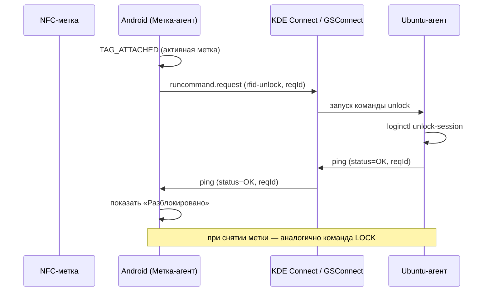

# Техническое задание: RFID/NFC-разблокировка ПК Ubuntu со смартфона Android

**Кодовое имя проекта:** Ubuntu-RFID-Android
**Версия документа:** 1.0 (черновик)
**Дата:** 2026-06-04
**Статус:** на согласование

---

## 1. Назначение документа

Документ описывает требования к разработке двух взаимодействующих приложений:

- **Android-приложение** («Метка-агент») для смартфона на Android 10.
- **Ubuntu-агент** (фоновый сервис/скрипт) для ПК на Ubuntu 24.04 LTS.

Сценарий: смартфон выступает физическим «ключом». Когда смартфон подносится к заранее
зарегистрированной активной NFC-метке — ПК **разблокируется**; когда смартфон снимается
с метки — ПК **блокируется**.

ТЗ предназначено для ИИ-команды разработки (архитектор, разработчики, техрайтер,
продукт-менеджер, проект-менеджер, QA-инженер) и содержит достаточный уровень детализации
для планирования, реализации, документирования и тестирования.

---

## 2. Глоссарий

| Термин | Описание |
|---|---|
| **NFC-метка (тег)** | Пассивная NFC-метка (NTAG213/215/216, MIFARE и т.п.), имеющая уникальный идентификатор UID. |
| **UID метки** | Уникальный аппаратный идентификатор NFC-метки, считываемый при поднесении. |
| **Активная метка** | Метка, для которой пользователь включил автоматизацию (разблокировка/блокировка ПК). |
| **Выключенная метка** | Метка сохранена в приложении, но автоматизация по ней не срабатывает. |
| **GSConnect** | Реализация протокола KDE Connect в виде расширения GNOME Shell для Ubuntu. |
| **KDE Connect** | Протокол и набор приложений для защищённого взаимодействия смартфона и ПК по локальной сети. |
| **Сопряжение (pairing)** | Установление доверенной TLS-связи между смартфоном и ПК в KDE Connect. |
| **Сессия (loginctl)** | Сессия пользователя systemd-logind, которой можно управлять (lock/unlock). |

---

## 3. Целевые платформы и оборудование

### 3.1. Смартфон (клиент-ключ)
- Устройство: **Samsung Galaxy S9+ (SM-G965F)**.
- ОС: **Android 10** (минимальный и целевой уровень — уточняется ниже).
- Аппаратные требования: встроенный **NFC-ридер** (присутствует на S9+).
- Сеть: Wi-Fi (та же локальная сеть, что и ПК).

### 3.2. ПК (управляемое устройство)
- ОС: **Ubuntu 24.04 LTS**.
- Окружение рабочего стола: **GNOME на сессии X11** (Xorg). Это целевое и единственное
  поддерживаемое окружение MVP. Wayland из объёма работ исключён.
- Менеджер сессий: **systemd-logind** (`loginctl`).
- Установлено и настроено расширение **GSConnect**.

### 3.3. Предусловия
- На смартфоне установлено приложение **KDE Connect** (или совместимый клиент), на ПК — **GSConnect**.
- Смартфон и ПК **сопряжены** в KDE Connect и находятся в одной локальной сети.

---

## 4. Бизнес-цели и пользовательские истории

### 4.1. Цели
- Удобная бесконтактная (близкого действия) разблокировка/блокировка рабочего ПК.
- Управление набором меток и сценариев непосредственно со смартфона.
- Минимизация ручных действий: положил телефон на подставку с меткой — ПК разблокирован;
  забрал телефон — ПК заблокирован.

### 4.2. Пользовательские истории (Android)
- **US-1.** Как пользователь, я хочу **добавить новую NFC-метку**, поднеся смартфон к метке,
  чтобы система запомнила её UID.
- **US-2.** Как пользователь, я хочу **задать метке удобочитаемое имя** (например,
  «Подставка на столе»), чтобы различать метки.
- **US-3.** Как пользователь, я хочу **включать/выключать** автоматизацию для каждой метки
  отдельно.
- **US-4.** Как пользователь, я хочу видеть **список сохранённых меток** с их именами и
  статусом (активна/выключена).
- **US-5.** Как пользователь, я хочу **удалить** метку из списка.
- **US-6.** Как пользователь, я хочу, чтобы при поднесении смартфона к **активной** метке ПК
  **разблокировался автоматически**.
- **US-7.** Как пользователь, я хочу, чтобы при снятии смартфона с активной метки ПК
  **блокировался автоматически**.
- **US-8.** Как пользователь, я хочу **видеть статус** последней операции (отправлено /
  подтверждено ПК / ошибка).
- **US-9.** Как пользователь, я хочу **выбрать целевой ПК** (если сопряжено несколько устройств).
- **US-13.** Как пользователь, я хочу **добавить ПК**, отсканировав смартфоном **QR-код**,
  который агент показывает на экране ПК (иконка в системном трее → «Показать QR-код»).
- **US-14.** Как пользователь, я хочу видеть **главный экран с плитками** добавленных ПК:
  имя ПК и текущий статус (заблокирован / разблокирован / недоступен).
- **US-15.** Как пользователь, я хочу **по клику на плитку** изменить статус ПК
  (заблокировать ↔ разблокировать).
- **US-16.** Как пользователь, я хочу **привязать NFC-метку к конкретному профилю ПК**
  или сделать её **«универсальной»**.
- **US-17.** Как пользователь, я хочу, чтобы поднесение **универсальной метки** просто
  **открывало приложение** на экране плиток ПК (без отправки команд).

### 4.3. Пользовательские истории (Ubuntu)
- **US-10.** Как пользователь ПК, я хочу, чтобы агент принимал команды только от
  **сопряжённого** доверенного смартфона.
- **US-11.** Как пользователь ПК, я хочу видеть/логировать события блокировки и разблокировки.

---

## 5. Функциональные требования

### 5.1. Android-приложение

#### 5.1.1. Работа с NFC
- **FR-A1.** Приложение считывает **UID** NFC-метки при поднесении смартфона.
- **FR-A2.** Приложение поддерживает режим **регистрации** новой метки (захват UID и сохранение).
- **FR-A3.** Приложение должно детектировать два события:
  - **TAG_ATTACHED** — метка поднесена/смартфон установлен на метку;
  - **TAG_REMOVED** — метка убрана/смартфон снят с метки.
- **FR-A4.** Детекция выполняется через **NFC Reader Mode** (`NfcAdapter.enableReaderMode`)
  с удержанием соединения с тегом (`IsoDep`/`NfcA` + `getTagPresence`/опрос) для надёжного
  определения момента **снятия** метки (см. раздел 9, технические заметки и риски).
- **FR-A4.1.** Опрос присутствия метки для детекции **снятия** (TAG_REMOVED → команда
  LOCK) должен запускаться **по триггеру акселерометра** смартфона, а не непрерывно:
  пока телефон лежит неподвижно на метке, считается, что метка на месте; при регистрации
  движения (`TYPE_ACCELEROMETER`/`TYPE_SIGNIFICANT_MOTION`) приложение выполняет внеочередной
  опрос NFC и, если метка больше не обнаружена, фиксирует TAG_REMOVED. Это снижает
  энергопотребление и нагрузку на NFC.
- **FR-A5.** Срабатывание автоматизации происходит **только для активных** меток.

#### 5.1.2. Управление метками
- **FR-A6.** CRUD-операции над метками: создать, прочитать (список/деталь), обновить (имя,
  статус), удалить.
- **FR-A7.** Хранение меток в **локальной БД** (Room/SQLite). Поля минимум: `uid`, `name`,
  `enabled`, `created_at`, `updated_at`.
- **FR-A8.** Защита от дублей: повторная регистрация уже известного UID обновляет
  существующую запись, а не создаёт новую.

#### 5.1.3. Отправка команд на ПК
- **FR-A9.** При событии TAG_ATTACHED активной метки — отправить команду **UNLOCK** на
  выбранный ПК.
- **FR-A10.** При событии TAG_REMOVED активной метки — отправить команду **LOCK**.
- **FR-A11.** Приложение получает и отображает **подтверждение** от ПК (успех/ошибка).
- **FR-A12.** При отсутствии связи/подтверждения — повтор (retry с backoff) и индикация
  ошибки пользователю.
- **FR-A13.** Выбор целевого устройства из списка сопряжённых (если их несколько).

#### 5.1.4. Интерфейс
- **FR-A14.** Экран «Список меток» (имя, статус, индикатор последнего действия).
- **FR-A15.** Экран «Добавить/редактировать метку».
- **FR-A16.** Экран «Настройки» (выбор ПК, параметры канала связи, диагностика/лог).
- **FR-A17.** Индикация состояния NFC (включён/выключен) и подсказки по включению.

#### 5.1.5. Профили ПК, QR и плитки
- **FR-A19.** Добавление ПК сканированием **QR-кода** (ZXing). QR кодирует JSON-профиль:
  `{"v":1,"id":<uuid>,"name":<hostname>,"host":<lan-ip>,"port":<port>,"token":<token>}`.
  Версия (`v`) и обязательные поля (`id`,`host`,`token`) валидируются.
- **FR-A20.** Профиль ПК хранится в локальной БД (Room): `id` (UUID, первичный ключ),
  `name`, `host`, `port`, `token`. Повторное сканирование того же `id` обновляет профиль.
- **FR-A21.** **Главный (стартовый) экран** — сетка **плиток** профилей ПК: имя ПК и
  статус цветной пиктограммой замка (заблокирован / разблокирован / недоступен).
- **FR-A22.** Статус ПК запрашивается **по требованию** (при открытии экрана и по кнопке
  «Обновить»), без фонового периодического опроса.
- **FR-A23.** **Клик по плитке** переключает статус ПК: заблокирован → UNLOCK,
  разблокирован → LOCK.
- **FR-A24.** Каждая NFC-метка может быть **привязана к профилю ПК** (`profileId`) либо
  быть **«универсальной»** (`profileId = null`).
- **FR-A25.** Поднесение метки, привязанной к профилю, отправляет команды LOCK/UNLOCK на
  этот ПК (по выбранной логике метки). Поднесение **универсальной** метки **открывает
  экран плиток** без отправки команд.
- **FR-A26.** Управление профилями (просмотр, удаление) доступно на экране «Настройки».

### 5.2. Ubuntu-агент

- **FR-U1.** Агент принимает команды **UNLOCK** и **LOCK** от доверенного смартфона.
- **FR-U2.** По команде **LOCK** — блокировать сессию (эквивалент `loginctl lock-session`
  / `dbus` ScreenSaver Lock).
- **FR-U3.** По команде **UNLOCK** — разблокировать сессию (эквивалент
  `loginctl unlock-session`). См. раздел 9 по ограничениям unlock в GNOME/Wayland.
- **FR-U4.** Агент отправляет **подтверждение** результата обратно на смартфон.
- **FR-U5.** Агент ведёт **журнал** событий (timestamp, команда, источник, результат).
- **FR-U6.** Агент игнорирует команды от несопряжённых/недоверенных источников.
- **FR-U7.** Команда **STATUS** возвращает текущее состояние сессии (заблокирована/нет)
  для отображения статуса на плитке ПК.
- **FR-U8.** Агент предоставляет **иконку в системном трее** с пунктом «Показать QR-код»,
  отображающим QR профиля ПК (`id`/`name`/`host`/`port`/`token`) для добавления ПК в
  Android-приложении одним сканированием. `id` — стабильный UUID, хранимый в конфиге.

---

## 6. Архитектура и канал связи

### 6.1. Основной канал — GSConnect / KDE Connect

По требованию заказчика основным и единственным (на старте) каналом является
**GSConnect/KDE Connect**, поскольку он уже установлен и обеспечивает сопряжение и
шифрованный TLS-транспорт между устройствами в локальной сети.

Рассмотрены три способа реализации поверх KDE Connect; **рекомендуемый — вариант A**.

#### Вариант A (рекомендуемый) — плагин «Run Command» + обратная связь через уведомления/пинг
- На ПК в GSConnect настраиваются команды плагина **Run Command**:
  - `rfid-lock` → блокировка сессии;
  - `rfid-unlock` → разблокировка сессии (через Ubuntu-агент, см. ниже).
- Android-приложение отправляет запрос на выполнение нужной команды через KDE Connect
  пакет плагина Run Command (`kdeconnect.runcommand.request`).
- **Подтверждение**: Ubuntu-агент (вызываемый командой) после выполнения отправляет на
  смартфон ответ — через плагин **Ping** (`kdeconnect.ping` с текстом-статусом) либо
  уведомление. Android-приложение слушает входящие пакеты и сопоставляет их с запросом.
- Плюсы: не требует модификации GSConnect; использует штатные плагины.
- Минусы: «Run Command» по природе односторонний — обратный канал реализуется отдельно
  (Ping/Notification), нужна корреляция запрос↔ответ по идентификатору.

#### Вариант B — собственная реализация клиента KDE Connect в Android-приложении
- Приложение само реализует часть протокола KDE Connect (mDNS-обнаружение, TLS,
  обмен пакетами) и общается с GSConnect напрямую, используя существующее сопряжение.
- Плюсы: полный контроль над двусторонним обменом и корреляцией ответов.
- Минусы: высокая сложность, поддержка протокола и TLS-сертификатов сопряжения.

#### Вариант C — кастомный плагин/скрипт на стороне ПК + Run Command как триггер
- На ПК запускается **собственный Ubuntu-агент** (Python/systemd user service), который
  фактически выполняет lock/unlock и формирует ответ; GSConnect Run Command служит лишь
  триггером, агент же реализует надёжную обратную связь (через KDE Connect Ping или
  отдельный локальный сокет/обёртку).
- Рекомендуется как дополнение к варианту A.

**Итоговая рекомендация для MVP:** Вариант **A + C** — Android шлёт `runcommand.request`,
команда запускает Ubuntu-агент, агент выполняет действие и шлёт подтверждение через Ping.

### 6.2. Реализация LOCK/UNLOCK на Ubuntu
- **LOCK:**
  - `loginctl lock-session` или D-Bus вызов
    `org.gnome.ScreenSaver.Lock` / `org.freedesktop.login1` `LockSession`.
- **UNLOCK:**
  - `loginctl unlock-session <session-id>` (через `org.freedesktop.login1` `UnlockSession`).
  - Целевое окружение — **GNOME на X11**, где разблокировка через `loginctl unlock-session`
    / D-Bus `org.gnome.ScreenSaver.SetActive false` работает штатно. PoC всё же выполняется
    для подтверждения на конкретной машине, но критический риск Wayland снят.

### 6.3. Альтернативные каналы (вне MVP, на будущее)
Зафиксированы как запасные варианты на случай ограничений GSConnect:
MQTT-брокер в локальной сети, HTTP/WebSocket-сервер на ПК, BLE. В MVP **не реализуются**.

### 6.4. Диаграмма потока (упрощённо)

---

## 7. Безопасность

### 7.1. Этап 1 (MVP) — без дополнительного шифрования
- Используется штатное шифрование транспорта **KDE Connect (TLS) + сопряжение устройств**.
- Команды принимаются только от сопряжённого устройства.
- Дополнительный прикладной слой шифрования/подписи **не реализуется** на этапе 1.

### 7.2. Этап 2 — прикладное шифрование/аутентификация команд
- Добавить подпись/шифрование полезной нагрузки команд (например, HMAC или асимметричная
  подпись), чтобы исключить подделку и повтор (anti-replay: nonce + timestamp).
- Привязка к идентификатору устройства и метке; защита от replay-атак.
- Требования детализируются отдельным документом на этапе 2.

### 7.3. Общие требования безопасности
- Никаких секретов в открытом виде в коде/репозитории.
- Логи не должны содержать чувствительных данных.
- Принцип наименьших привилегий для Ubuntu-агента (запуск от пользователя, без root, если
  возможно).

---

## 8. Нефункциональные требования

- **NFR-1. Производительность:** задержка от события метки до блокировки/разблокировки —
  целевая ≤ 2 c в локальной сети.
- **NFR-2. Надёжность:** механизм повторов при сбое доставки; идемпотентность команд
  (повтор UNLOCK не ломает состояние).
- **NFR-3. Энергопотребление:** детекция снятия метки организована «по событию»
  (триггер акселерометра), а не непрерывным опросом NFC, чтобы минимизировать
  разряд батареи; оценить влияние фонового слушателя датчика движения.
- **NFR-4. Доступность:** корректное поведение при выключенном NFC, отсутствии сети,
  несопряжённом ПК (понятные сообщения).
- **NFR-5. Локализация:** интерфейс на русском (минимум), архитектура — с заделом под i18n.
- **NFR-6. Логирование/диагностика:** экран диагностики на смартфоне и журнал на ПК.
- **NFR-7. Конфиденциальность:** данные меток хранятся только локально на смартфоне.

---

## 9. Технические заметки и известные сложности

- **Детекция снятия NFC-метки (критично).** Android не имеет прямого «tag removed»
  broadcast. Надёжный подход — `enableReaderMode` + удержание `IsoDep`/`NfcA` соединения и
  периодическая проверка присутствия (`isConnected()`/транзакция-зонд). Потеря соединения =
  TAG_REMOVED. Требуется PoC и подбор интервала опроса (баланс отзывчивость/энергия).
- **Окружение X11.** Целевая сессия — **Xorg/X11**, где `unlock-session` и управление
  ScreenSaver работают предсказуемо. Wayland не поддерживается в MVP; при будущем переходе
  на Wayland потребуется отдельная проработка разблокировки.
- **GSConnect Run Command** должен быть предварительно сконфигурирован (команды
  `rfid-lock`, `rfid-unlock`) — это часть инструкции по установке (техрайтер).
- **Обратный канал.** Корреляция ответа с запросом по `reqId` (генерируется на смартфоне,
  возвращается в Ping/уведомлении от агента).
- **Несколько устройств.** Поддержать выбор целевого ПК и фильтрацию ответов по устройству.

---

## 10. Этапы разработки (Roadmap)

### Этап 0 — Исследование/PoC (обязательно до MVP)
- PoC NFC Reader Mode с детекцией attach/remove на S9+/Android 10.
- PoC триггера опроса по акселерометру: подбор порога движения и задержки до LOCK.
- PoC lock/unlock на Ubuntu 24.04 (**X11**) через loginctl/D-Bus.
- PoC отправки `runcommand.request` из Android в GSConnect и приёма Ping-ответа.

### Этап 1 — MVP (без прикладного шифрования)
- Android: NFC-регистрация, CRUD меток, активные/выключенные, отправка LOCK/UNLOCK,
  приём подтверждений, базовый UI.
- Ubuntu: агент lock/unlock + подтверждение + журнал.
- Канал: GSConnect Run Command + Ping (вариант A+C).
- Документация: руководство по установке и настройке GSConnect.

### Этап 2 — Безопасность и зрелость
- Прикладное шифрование/подпись команд, anti-replay.
- Улучшенная диагностика, метрики, обработка краевых случаев.
- Опционально: альтернативные каналы связи.

---

## 11. Открытые вопросы (требуют решения на PoC)

1. Подтвердить на целевой машине, что разблокировка GNOME-сессии на **X11** через
   `loginctl unlock-session` / D-Bus ScreenSaver работает без доп. прав (ожидается «да»).
2. Достаточна ли точность/скорость детекции **снятия** NFC-метки в Reader Mode для UX ≤ 2 c?
   Какой порог акселерометра оптимален и нужен ли резервный редкий периодический опрос?
3. Какой обратный канал стабильнее в GSConnect — **Ping** или **Notification** — для
   подтверждений?
4. Нужна ли работа при **заблокированном экране смартфона** (NFC в фоне) и как это влияет на
   политику Android 10 по фоновому NFC?

---

## 12. Критерии приёмки (MVP)

- **AC-1.** Регистрация метки по UID работает; имя задаётся и сохраняется.
- **AC-2.** Метку можно включить/выключить; выключенная не вызывает действий.
- **AC-3.** Поднесение смартфона к активной метке разблокирует ПК (или корректная ошибка).
- **AC-4.** Снятие смартфона с активной метки блокирует ПК.
- **AC-5.** Смартфон отображает подтверждение результата от ПК.
- **AC-6.** ПК ведёт журнал событий lock/unlock.
- **AC-7.** Команды от несопряжённых устройств игнорируются.
- **AC-8.** Время отклика в локальной сети ≤ 2 c (целевое).

---

## 13. План тестирования (для QA)

- **Функциональные тесты:** все US/FR из разделов 4–5.
- **Негативные сценарии:** NFC выключен, нет Wi-Fi, ПК не сопряжён, ПК выключен,
  дубль UID, быстрые повторные attach/remove.
- **Интеграционные:** полный путь телефон→GSConnect→агент→подтверждение.
- **Совместимость:** целевая сессия X11; несколько сопряжённых устройств.
- **Нефункциональные:** замер задержки, влияние на батарею, стабильность при длительной
  работе Reader Mode.
- **Безопасность (этап 2):** проверка отклонения подделанных/повторных команд.

---

## 14. Поставляемые артефакты

- Исходный код Android-приложения (с инструкцией сборки).
- Исходный код Ubuntu-агента + unit/systemd-сервис.
- Руководство по установке и настройке (GSConnect Run Command, сопряжение) — Markdown.
- Руководство пользователя — Markdown.
- Отчёты PoC по открытым вопросам — Markdown.
- Тест-план и результаты тестирования.

> Примечание: все текстовые документы проекта ведутся в формате **Markdown**.
